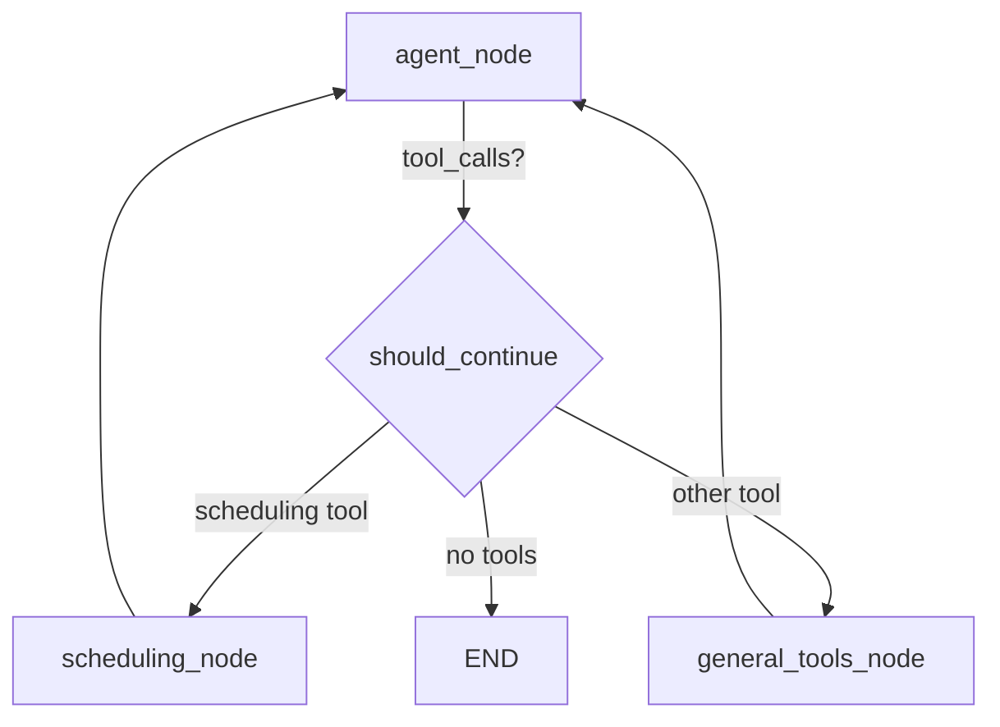

# Separate Scheduling Node — Render-Independent Design

## Problem

The current scheduling system uses **APScheduler** running as a background thread inside the FastAPI process on Render. This has critical issues:

1. **Render free tier sleeps** after 15 min of inactivity — all in-memory/SQLite scheduled jobs are lost or unexecutable
2. **Single ToolNode** bundles all 9 tools together — no way to add scheduling-specific logic (validation, confirmation, state tracking)
3. **No visibility** — the Flutter app has no way to query pending scheduled messages without hitting the agent

## Proposed Solution

Move scheduling persistence to **Supabase** (a `scheduled_messages` table) and separate scheduling tools into their own **LangGraph node**. Execution happens via a Supabase **pg_cron** job or Edge Function — completely decoupled from Render.



## User Review Required

> [!IMPORTANT]
> This plan **removes APScheduler** entirely and replaces it with a Supabase `scheduled_messages` table + a cron-based executor. This means:
> - Scheduled messages survive Render restarts/sleeps
> - The Flutter app could also query scheduled messages directly from Supabase
> - You'll need to add a pg_cron job or Supabase Edge Function to your Supabase project

> [!WARNING]
> The existing `data/jobs.sqlite` file and APScheduler infrastructure will be removed. Any currently scheduled jobs in SQLite will be lost. If there are pending jobs you care about, they'd need to be migrated manually.

## Proposed Changes

### Graph Architecture

#### [MODIFY] [graph.py](file:///Users/shoebmohammedkhan/Documents/Developer/Chat%20App%20github/Flutter-chat-claude/smartchat-agent/src/agent/graph.py)

Split the single `ToolNode` into two nodes with routing logic:

```diff
-tools = [send_message, find_contacts, ..., schedule_message, list_scheduled_messages, cancel_scheduled_message]
-tool_node = ToolNode(tools)
+# General tools — messaging, search, analytics
+general_tools = [send_message, find_contacts, get_recent_conversations,
+                 summarize_conversation, get_daily_digest, analyze_sentiment]
+
+# Scheduling tools — separate node
+scheduling_tools = [schedule_message, list_scheduled_messages, cancel_scheduled_message]
+
+all_tools = general_tools + scheduling_tools  # LLM sees all tools
+general_tool_node = ToolNode(general_tools)
+scheduling_tool_node = ToolNode(scheduling_tools)
```

Update `should_continue` to route based on which tool was called:

```python
SCHEDULING_TOOL_NAMES = {"schedule_message", "list_scheduled_messages", "cancel_scheduled_message"}

def should_continue(state):
    last = state["messages"][-1]
    if hasattr(last, "tool_calls") and last.tool_calls:
        names = {tc["name"] for tc in last.tool_calls}
        if names & SCHEDULING_TOOL_NAMES:
            return "scheduling_tools"
        return "general_tools"
    return END
```

Updated graph wiring:

```python
workflow.add_node("agent", agent_node)
workflow.add_node("general_tools", general_tool_node)
workflow.add_node("scheduling_tools", scheduling_tool_node)

workflow.add_conditional_edges("agent", should_continue, {
    "general_tools": "general_tools",
    "scheduling_tools": "scheduling_tools",
    END: END,
})
workflow.add_edge("general_tools", "agent")
workflow.add_edge("scheduling_tools", "agent")
```

---

### Supabase Persistence (replaces APScheduler)

#### [MODIFY] [scheduling.py](file:///Users/shoebmohammedkhan/Documents/Developer/Chat%20App%20github/Flutter-chat-claude/smartchat-agent/src/tools/scheduling.py)

Rewrite all three tools to use a Supabase `scheduled_messages` table instead of APScheduler:

- `schedule_message` → `INSERT` into `scheduled_messages`
- `list_scheduled_messages` → `SELECT ... WHERE sender_id = X AND status = 'pending'`
- `cancel_scheduled_message` → `UPDATE ... SET status = 'cancelled' WHERE id = X`

No `import` of `src.scheduler` anymore.

#### [NEW] Supabase SQL migration

Create a `scheduled_messages` table:

```sql
CREATE TABLE scheduled_messages (
  id UUID DEFAULT gen_random_uuid() PRIMARY KEY,
  sender_id UUID REFERENCES auth.users(id) NOT NULL,
  recipient_names TEXT[] NOT NULL,
  message TEXT NOT NULL,
  send_at TIMESTAMPTZ NOT NULL,
  status TEXT DEFAULT 'pending' CHECK (status IN ('pending', 'sent', 'cancelled', 'failed')),
  created_at TIMESTAMPTZ DEFAULT now(),
  sent_at TIMESTAMPTZ,
  error TEXT
);

-- Index for the cron executor to find due messages
CREATE INDEX idx_scheduled_pending ON scheduled_messages (send_at)
  WHERE status = 'pending';

-- RLS: users can only see their own
ALTER TABLE scheduled_messages ENABLE ROW LEVEL SECURITY;
CREATE POLICY "Users see own scheduled messages"
  ON scheduled_messages FOR ALL USING (auth.uid() = sender_id);
```

#### [NEW] Supabase pg_cron executor (or Edge Function)

A cron job that fires every minute, finds due messages, and sends them:

**Option A — pg_cron + database function** (simplest, no external service):
```sql
-- Runs every minute, finds due messages, inserts them into the messages table
SELECT cron.schedule('process-scheduled-messages', '* * * * *', $$
  -- ... SQL function that selects pending + past-due rows, inserts into messages, marks as sent
$$);
```

**Option B — Supabase Edge Function** (more flexible, can add error handling):
A Deno function triggered by a cron schedule that queries `scheduled_messages` and calls the Supabase API.

> [!NOTE]
> Option A is the lightest-weight approach. Option B gives you more control (retry logic, logging, notifications). Both are completely independent of Render.

---

### Cleanup

#### [DELETE/MODIFY] [scheduler.py](file:///Users/shoebmohammedkhan/Documents/Developer/Chat%20App%20github/Flutter-chat-claude/smartchat-agent/src/scheduler.py)

Remove the APScheduler singleton, SQLAlchemy job store, and `send_scheduled_message` callback entirely. The scheduling execution is now handled by Supabase.

#### [MODIFY] [server.py](file:///Users/shoebmohammedkhan/Documents/Developer/Chat%20App%20github/Flutter-chat-claude/smartchat-agent/server.py)

Remove the `lifespan` function that starts/stops the APScheduler. The server becomes stateless.

```diff
-@asynccontextmanager
-async def lifespan(app: FastAPI):
-    from src.scheduler import get_scheduler
-    scheduler = get_scheduler()
-    scheduler.start()
-    yield
-    scheduler.shutdown(wait=False)
-
-app = FastAPI(title="SmartChat Agent", version="0.1.0", lifespan=lifespan)
+app = FastAPI(title="SmartChat Agent", version="0.1.0")
```

#### [MODIFY] [pyproject.toml](file:///Users/shoebmohammedkhan/Documents/Developer/Chat%20App%20github/Flutter-chat-claude/smartchat-agent/pyproject.toml)

Remove `apscheduler` and `sqlalchemy` from dependencies (no longer needed).

---

## Summary of Benefits

| Before (APScheduler) | After (Supabase) |
|---|---|
| Jobs lost when Render sleeps | Jobs persist in Supabase forever |
| SQLite file on ephemeral Render disk | Supabase Postgres — reliable, backed up |
| Server must be running to fire jobs | pg_cron runs independently of your server |
| Flutter can't see scheduled msgs | Flutter can query `scheduled_messages` directly |
| Single ToolNode, no routing | Separate scheduling node in the graph |

## Verification Plan

### Manual Verification
1. Run `langgraph dev` locally and open LangGraph Studio
2. Verify the graph shows **3 nodes**: `agent`, `general_tools`, `scheduling_tools`
3. Test routing: send "find my contacts" → should route to `general_tools`
4. Test routing: send "schedule a message to Ahmed at 5pm saying hello" → should route to `scheduling_tools`
5. Check Supabase `scheduled_messages` table to confirm the row was inserted
6. Wait for the pg_cron to fire and verify the message appears in the `messages` table
