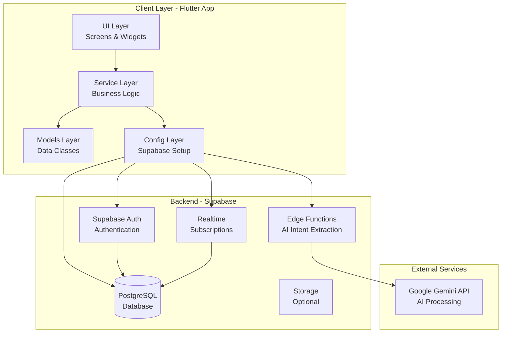
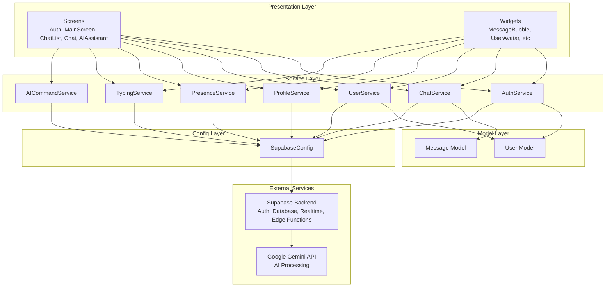
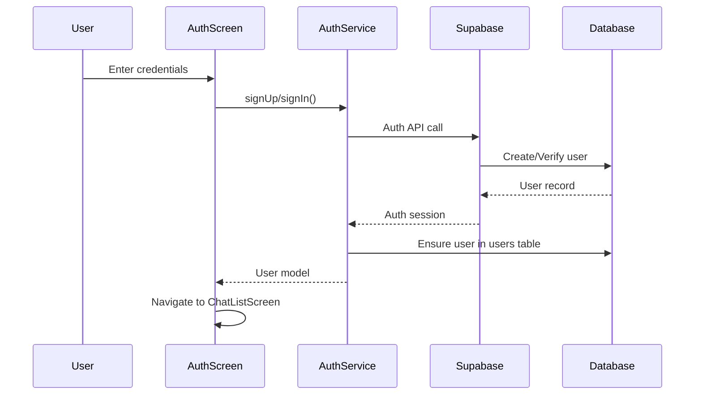
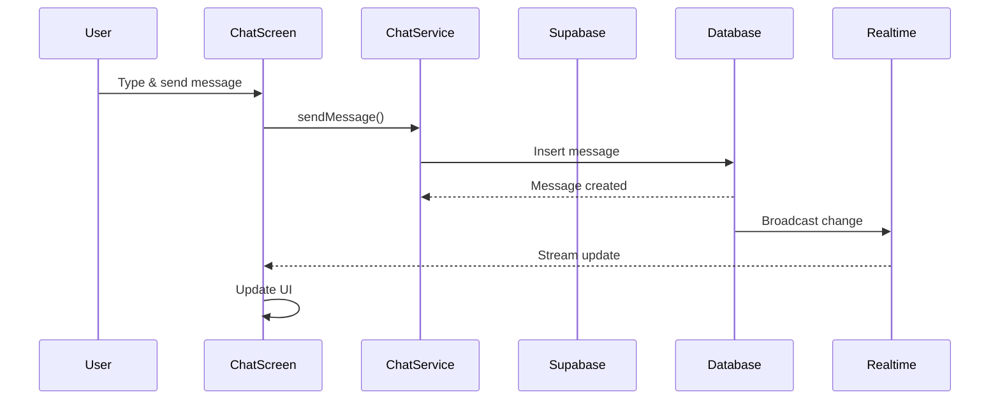
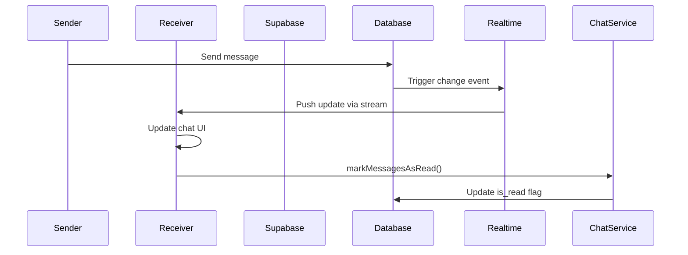
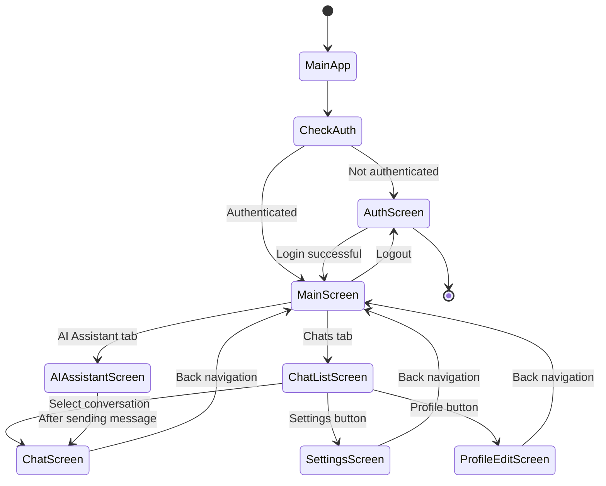
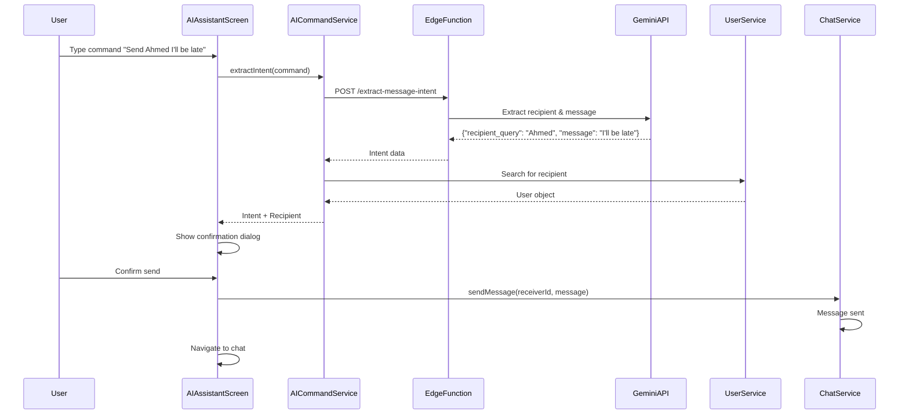
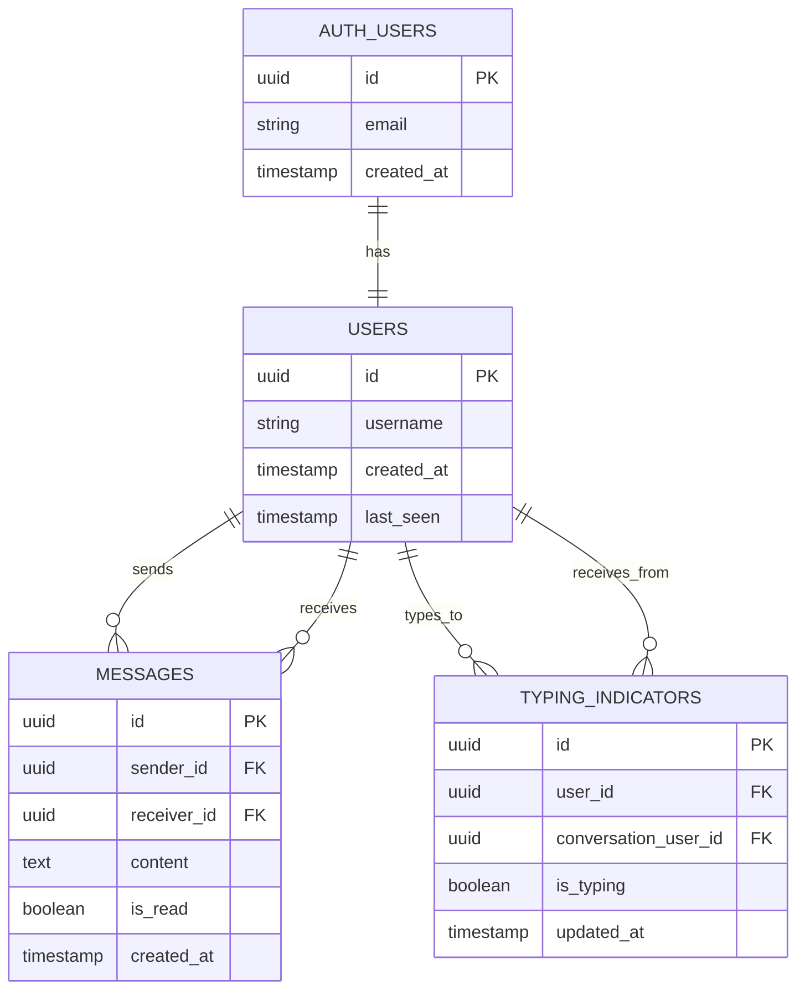
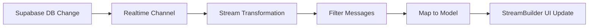
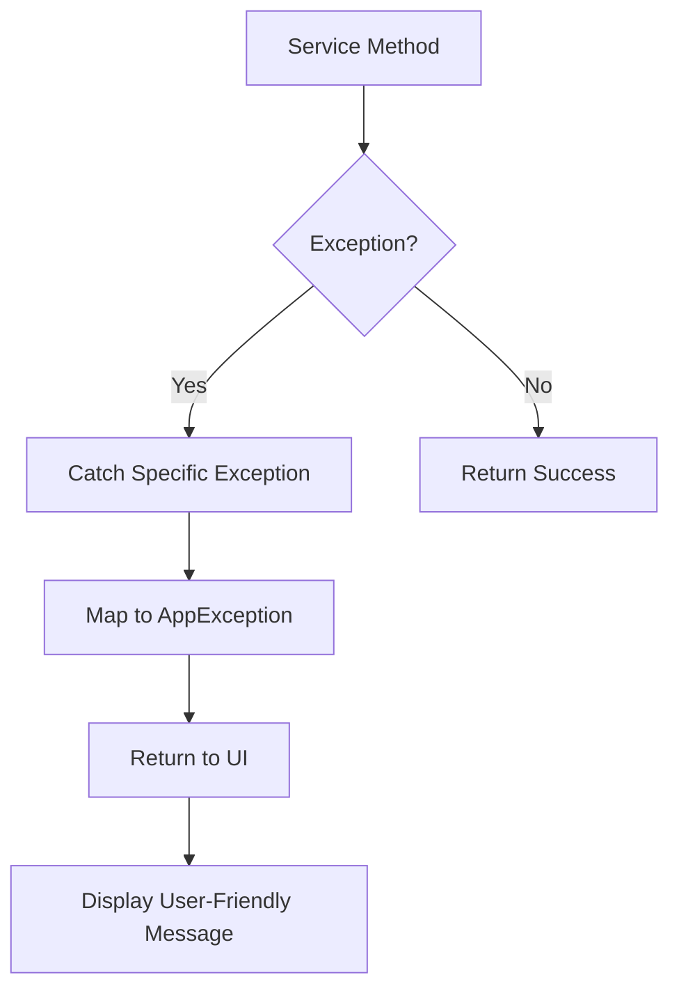

# Chat App Architecture Documentation

## Table of Contents
1. [Overview](#overview)
2. [System Architecture](#system-architecture)
3. [Project Structure](#project-structure)
4. [Data Flow](#data-flow)
5. [Component Details](#component-details)
6. [Technology Stack](#technology-stack)
7. [Database Schema](#database-schema)

---

## Overview

This is a real-time chat application built with Flutter and Supabase. The app enables users to authenticate, view a list of other users, engage in real-time conversations, and track unread messages.

### Key Features
- User authentication (Sign up / Sign in)
- Real-time messaging
- Chat list with conversation previews
- Unread message tracking
- Typing indicators
- Online/offline status (presence)
- User search functionality
- Profile editing (username, bio, profile picture)
- **AI-powered command-based messaging** - Send messages using natural language commands
- Dark/Light theme support
- Smooth animations and modern UI

---

## System Architecture

### High-Level Architecture Diagram



### Layered Architecture



---

## Project Structure

```
lib/
├── main.dart                    # App entry point
├── config/
│   └── supabase_config.dart    # Supabase initialization
├── exceptions/
│   └── app_exceptions.dart     # Custom exception classes
├── models/
│   ├── user.dart               # User data model
│   └── message.dart            # Message data model
├── screens/
│   ├── auth_screen.dart        # Authentication screen
│   ├── main_screen.dart        # Main container with bottom navigation
│   ├── chat_list_screen.dart   # List of conversations
│   ├── chat_screen.dart        # Individual chat screen
│   ├── ai_assistant_screen.dart # AI command interface
│   ├── profile_edit_screen.dart # Profile editing screen
│   └── settings_screen.dart    # App settings screen
├── services/
│   ├── auth_service.dart       # Authentication logic
│   ├── chat_service.dart       # Chat/messaging logic
│   ├── user_service.dart       # User management logic
│   ├── presence_service.dart   # Online/offline status management
│   ├── typing_service.dart     # Typing indicators management
│   ├── ai_command_service.dart # AI intent extraction and recipient resolution
│   └── theme_service.dart      # Theme preference persistence
├── theme/
│   └── app_theme.dart          # App theming
├── utils/
│   ├── constants.dart          # App constants
│   └── date_utils.dart         # Date formatting utilities
└── widgets/
    ├── loading_shimmer.dart    # Loading placeholder
    ├── message_bubble.dart     # Individual message widget
    ├── message_input.dart      # Message input field
    └── user_avatar.dart        # User avatar widget

supabase/
└── functions/
    └── extract-message-intent/
        ├── index.ts            # Edge Function for AI intent extraction
        └── README.md           # Function documentation
```

### Directory Responsibilities

| Directory | Purpose |
|-----------|---------|
| `config/` | Configuration and initialization code (Supabase setup) |
| `exceptions/` | Custom exception classes for error handling |
| `models/` | Data classes representing domain entities |
| `screens/` | Full-screen UI components (pages/views) |
| `services/` | Business logic and data access layer |
| `theme/` | App-wide theming and styling |
| `utils/` | Helper functions and constants |
| `widgets/` | Reusable UI components |
| `supabase/functions/` | Supabase Edge Functions (serverless functions) |

---

## Data Flow

### Authentication Flow



### Message Sending Flow



### Real-time Message Reception Flow



### Screen Navigation Flow



### AI Command Flow



---

## Component Details

### Models

#### User Model
```dart
User {
  String id          // UUID from Supabase auth
  String username    // Display name (3-50 chars)
  String? email      // Optional email
  String? avatarUrl  // Profile picture URL
  String? bio        // User bio (max 500 chars)
  DateTime? createdAt
  DateTime? lastSeen
  DateTime? updatedAt
}
```

**Responsibilities:**
- Represents a user entity
- Handles JSON serialization/deserialization
- Provides copyWith for immutability

#### Message Model
```dart
Message {
  String? id          // Message UUID
  String senderId     // Sender's user ID
  String receiverId   // Receiver's user ID
  String content      // Message text
  bool isRead         // Read status
  DateTime createdAt  // Timestamp
}
```

**Responsibilities:**
- Represents a chat message
- Handles message direction logic
- Provides helper methods (isSentBy, getOtherUserId)

---

### Services

#### AuthService
**Purpose:** Handles all authentication operations

**Key Methods:**
- `signUp()` - Register new user
- `signIn()` - Authenticate existing user
- `signOut()` - End user session
- `getCurrentUserProfile()` - Fetch current user data

**Dependencies:**
- Supabase Client (auth & database)

#### ChatService
**Purpose:** Manages messaging and conversation logic

**Key Methods:**
- `sendMessage()` - Send a new message
- `getConversationStream()` - Real-time message stream for a conversation
- `markMessagesAsRead()` - Update read status
- `processConversations()` - Aggregate conversation data

**Dependencies:**
- Supabase Client (database & realtime)

#### UserService
**Purpose:** Manages user data operations

**Key Methods:**
- `getUsersStream()` - Real-time stream of all users
- `getOtherUsersStream()` - Users excluding current user
- `searchUsers()` - Search users by username
- `getUserById()` - Fetch specific user
- `updateProfile()` - Update user profile (username, bio, avatar)
- `checkUsernameAvailability()` - Check if username is available

**Dependencies:**
- Supabase Client (database)

#### ProfileService
**Purpose:** Handles profile-related operations including image uploads

**Key Methods:**
- `uploadProfileImage()` - Upload profile picture to Supabase Storage
- `deleteProfileImage()` - Delete profile picture from storage
- `compressImage()` - Compress and optimize images (max 2000x2000px, 5MB)
- `validateUsername()` - Validate username format (3-50 chars, alphanumeric + underscore/hyphen)
- `validateBio()` - Validate bio length (max 500 chars)

**Dependencies:**
- Supabase Client (storage & database)
- Image processing library
- Platform-specific file handling

**Features:**
- Cross-platform image upload (web uses uploadBinary, mobile uses File)
- Automatic image compression and optimization
- Image validation (size, type, dimensions)
- Error handling with rollback mechanisms

#### PresenceService
**Purpose:** Manages user online/offline status

**Key Methods:**
- `updateLastSeen()` - Updates the current user's last_seen timestamp
- `startHeartbeat()` - Starts periodic heartbeat to update last_seen
- `stopHeartbeat()` - Stops the periodic heartbeat
- `dispose()` - Cleans up resources

**Dependencies:**
- Supabase Client (database & RPC functions)

**Usage:**
- Automatically updates user's last_seen when app is active
- Called on app foreground/background events
- Uses periodic timer (default: 30 seconds)

#### TypingService
**Purpose:** Manages real-time typing indicators

**Key Methods:**
- `setTyping()` - Sets typing status for a conversation
- `startTyping()` - Starts typing indicator (auto-stops after timeout)
- `stopTyping()` - Stops typing indicator
- `getTypingStream()` - Returns stream of typing status for a conversation
- `dispose()` - Cleans up resources

**Dependencies:**
- Supabase Client (database & realtime)

**Features:**
- Automatic timeout (3 seconds) if stopTyping is not called
- Real-time stream updates via Supabase subscriptions
- Filters typing status by conversation participants
- Validates typing status freshness (within 5 seconds)

#### AICommandService
**Purpose:** Handles AI-powered intent extraction and recipient resolution

**Key Methods:**
- `extractIntent(String command)` - Calls Supabase Edge Function to extract recipient and message from natural language
- `resolveRecipient(String query, List<User> users)` - Finds matching user from recipient query

**Dependencies:**
- Supabase Client (Edge Functions)

**Features:**
- Natural language command parsing via Google Gemini API
- Automatic recipient matching (exact, partial, fuzzy)
- Error handling for extraction failures
- Returns structured intent data (recipient_query, message)

#### ThemeService
**Purpose:** Manages theme preference persistence

**Key Methods:**
- `loadThemeMode()` - Loads saved theme mode from SharedPreferences
- `saveThemeMode()` - Saves theme mode preference to SharedPreferences

**Dependencies:**
- SharedPreferences (local storage)

**Features:**
- Persists theme preference (System, Light, Dark) across app restarts
- Defaults to System theme if no preference is saved
- Static methods for easy access

---

### Screens

#### AuthScreen
**Purpose:** User authentication interface

**Features:**
- Toggle between Sign In / Sign Up
- Form validation
- Error handling and display
- Smooth animations

**State Management:**
- Local state with StatefulWidget
- Form validation
- Loading states

#### MainScreen
**Purpose:** Main container screen with bottom navigation

**Features:**
- Bottom navigation bar with two tabs: Chats and AI Assistant
- Tab switching between ChatListScreen and AIAssistantScreen
- Maintains navigation state

**State Management:**
- Local state with StatefulWidget
- Index-based tab navigation

#### ChatListScreen
**Purpose:** Display list of conversations

**Features:**
- Real-time user list
- Conversation previews (last message)
- Unread message badges
- User search
- Settings navigation
- Logout functionality

**State Management:**
- StreamBuilder for real-time updates
- Combined streams (users + messages)
- Search filtering

#### AIAssistantScreen
**Purpose:** AI-powered command interface for natural language messaging

**Features:**
- Natural language command input
- AI intent extraction via Edge Function
- Recipient resolution and confirmation dialog
- Message sending with user confirmation
- Error handling and loading states
- Example command hints

**State Management:**
- Local state with StatefulWidget
- Loading states during AI processing
- Error states for failed extractions

#### ChatScreen
**Purpose:** Individual conversation interface

**Features:**
- Real-time message display
- Message input with send button
- Read status tracking

#### ProfileEditScreen
**Purpose:** User profile editing interface

**Features:**
- Edit username with real-time validation
- Edit bio (optional, multiline, 500 char limit)
- Upload/change profile picture (camera or gallery)
- Remove profile picture
- Username availability checking
- Image compression and preview
- Error handling with rollback

**State Management:**
- Local state with StatefulWidget
- Form validation
- Loading states
- Error states

#### SettingsScreen
**Purpose:** App settings and preferences interface

**Features:**
- Theme selection (System, Light, Dark)
- Radio button selection for theme modes
- Real-time theme updates
- Theme preference persistence

**State Management:**
- Local state with StatefulWidget
- Syncs with MyApp theme state
- Updates UI when theme changes

---

### Widgets

#### MessageBubble
**Purpose:** Display individual message

**Features:**
- Sent vs received styling
- Read/unread indicators
- Timestamp display
- Smooth animations

#### UserAvatar
**Purpose:** Display user profile picture/initial

**Features:**
- Fallback to initials if no image
- Color coding by user
- Circular design

#### MessageInput
**Purpose:** Message composition widget

**Features:**
- Text input field
- Send button
- Input validation
- Auto-focus

#### LoadingShimmer
**Purpose:** Loading placeholder

**Features:**
- Shimmer animation effect
- List item placeholders
- Used during data loading

---

## Technology Stack

### Frontend
- **Framework:** Flutter (Dart SDK ^3.10.3)
- **State Management:** StatefulWidget + StreamBuilder
- **UI Libraries:**
  - `google_fonts` - Custom typography
  - `flutter_animate` - Animations
  - `shimmer` - Loading effects

### Backend
- **BaaS:** Supabase
  - **Auth:** Email/password authentication
  - **Database:** PostgreSQL (via Supabase)
  - **Realtime:** WebSocket-based real-time subscriptions
  - **Edge Functions:** Serverless functions for AI intent extraction

### External Services
- **Google Gemini API:** Natural language processing for command extraction
  - Model: `gemini-1.5-flash` (primary, with fallback to `gemini-pro`)
  - Automatic model fallback for reliability

### Key Dependencies

```yaml
supabase_flutter: ^2.0.0      # Backend integration (includes Edge Functions)
intl: ^0.19.0                  # Internationalization
google_fonts: ^6.1.0           # Typography
shimmer: ^3.0.0                # Loading animations
flutter_animate: ^4.5.0        # UI animations
timeago: ^3.6.1                # Relative time formatting
shared_preferences: ^2.2.2     # Local storage for preferences
```

**Supabase Edge Functions:**
- `extract-message-intent`: AI intent extraction using Google Gemini API
  - Language: TypeScript (Deno runtime)
  - External API: Google Gemini API
  - Features: Model fallback, CORS support, input validation

---

## Database Schema

### Tables

#### users
```sql
CREATE TABLE users (
  id UUID PRIMARY KEY REFERENCES auth.users(id),
  username TEXT NOT NULL,
  avatar_url TEXT,
  bio TEXT,
  created_at TIMESTAMP WITH TIME ZONE DEFAULT NOW(),
  last_seen TIMESTAMP WITH TIME ZONE DEFAULT NOW(),
  updated_at TIMESTAMP WITH TIME ZONE DEFAULT NOW(),
  CONSTRAINT check_username_length CHECK (LENGTH(username) >= 3 AND LENGTH(username) <= 50),
  CONSTRAINT check_bio_length CHECK (bio IS NULL OR LENGTH(bio) <= 500),
  CONSTRAINT users_username_key UNIQUE (username)
);
```

**Relationships:**
- `id` references `auth.users.id` (one-to-one with Supabase auth)

**Indexes:**
```sql
CREATE INDEX idx_users_last_seen ON users(last_seen);
```

#### messages
```sql
CREATE TABLE messages (
  id UUID PRIMARY KEY DEFAULT gen_random_uuid(),
  sender_id UUID REFERENCES users(id),
  receiver_id UUID REFERENCES users(id),
  content TEXT NOT NULL,
  is_read BOOLEAN DEFAULT FALSE,
  created_at TIMESTAMP WITH TIME ZONE DEFAULT NOW()
);
```

**Relationships:**
- `sender_id` → `users.id` (many-to-one)
- `receiver_id` → `users.id` (many-to-one)

**Indexes:**
```sql
CREATE INDEX idx_messages_receiver_unread 
ON messages(receiver_id, is_read) 
WHERE is_read = FALSE;
```

#### typing_indicators
```sql
CREATE TABLE typing_indicators (
  id UUID PRIMARY KEY DEFAULT gen_random_uuid(),
  user_id UUID REFERENCES users(id) ON DELETE CASCADE NOT NULL,
  conversation_user_id UUID REFERENCES users(id) ON DELETE CASCADE NOT NULL,
  is_typing BOOLEAN DEFAULT FALSE NOT NULL,
  updated_at TIMESTAMP WITH TIME ZONE DEFAULT NOW() NOT NULL,
  UNIQUE(user_id, conversation_user_id)
);
```

**Relationships:**
- `user_id` → `users.id` (many-to-one, the user who is typing)
- `conversation_user_id` → `users.id` (many-to-one, the user being typed to)

**Indexes:**
```sql
CREATE INDEX idx_typing_indicators_conversation 
ON typing_indicators(conversation_user_id, is_typing) 
WHERE is_typing = TRUE;
```

### Database Functions

#### mark_messages_as_read(sender_user_id UUID)
**Purpose:** Marks messages as read for a specific sender
- Security: SECURITY DEFINER (bypasses RLS)
- Returns: Number of messages updated
- Used by: ChatService

#### update_last_seen()
**Purpose:** Updates the current authenticated user's last_seen timestamp
- Security: SECURITY DEFINER (bypasses RLS)
- Used by: PresenceService

### Entity Relationship Diagram



---

## Real-time Architecture

### Stream Subscription Pattern

The app uses Supabase's real-time streams to update UI automatically:

1. **User Stream:**
   ```dart
   Stream<List<User>> getUsersStream()
   ```
   - Subscribes to `users` table changes
   - Updates when users are added/modified

2. **Message Stream:**
   ```dart
   Stream<List<Message>> getConversationStream(String otherUserId)
   ```
   - Subscribes to `messages` table changes
   - Filters by conversation participants
   - Orders by creation time

3. **Typing Indicator Stream:**
   ```dart
   Stream<bool> getTypingStream(String conversationUserId)
   ```
   - Subscribes to `typing_indicators` table changes
   - Filters by conversation participants
   - Validates typing status freshness

### Stream Processing



---

## Error Handling

### Exception Hierarchy

```
AppException (abstract)
├── AuthException
│   ├── invalidCredentials()
│   ├── userNotFound()
│   ├── notAuthenticated()
│   └── emailInUse()
├── NetworkException
├── DatabaseException
├── ChatException
│   ├── emptyMessage()
│   └── sendFailed()
└── AICommandException
    ├── extractionFailed()
    └── recipientNotFound()
```

### Error Flow



---

## Theme System

### Theme Structure

```dart
AppTheme {
  lightTheme: ThemeData
  darkTheme: ThemeData
}
```

**Features:**
- Light and dark mode support
- Custom color schemes
- Typography using Google Fonts
- Consistent spacing and styling

### Theme Mode

- **System default:** Follows device preference
- **Theme selection:** User can choose between System, Light, or Dark theme via Settings screen
- **Persistence:** Theme preference is saved using SharedPreferences and persists across app restarts
- **Access:** Settings screen accessible from ChatListScreen AppBar

---

## Security Considerations

### Authentication
- Uses Supabase Auth for secure authentication
- Passwords handled by Supabase (never stored locally)
- JWT tokens managed by Supabase client

### Data Security
- Row Level Security (RLS) should be configured on Supabase
- User can only access their own messages
- User can only update their own profile
- Storage policies restrict profile picture uploads to user's own folder
- User IDs verified on client and server

### Configuration
- Supabase credentials via `--dart-define` flags
- Fallback values for development only
- Production should use environment variables

---

## Performance Optimizations

1. **Stream Efficiency:**
   - Primary key indexing for efficient real-time subscriptions
   - Filtered streams to reduce data transfer

2. **UI Performance:**
   - Shimmer loading states prevent layout shifts
   - Efficient ListView.builder usage
   - Image caching for avatars

3. **Database:**
   - Indexed queries on `receiver_id` and `is_read`
   - Partial indexes for unread messages
   - Unique constraint on username for fast availability checks
   - Index on `avatar_url` for efficient queries

4. **Image Optimization:**
   - Automatic compression (max 2000x2000px, quality 85)
   - JPEG format for smaller file sizes
   - Progressive quality reduction if needed

---

## Future Enhancements

Potential improvements and features:

- [ ] Push notifications
- [ ] Image/file sharing
- [ ] Message reactions
- [ ] Group chats
- [ ] Message search
- [ ] Message deletion
- [x] Profile editing (username, bio, profile picture)
- [x] Theme toggle UI
- [x] AI-powered command-based messaging
- [ ] Read receipts (detailed)
- [ ] Message encryption
- [ ] Multiple recipient support in AI commands
- [ ] Scheduled messages via AI commands
- [ ] Command history for AI Assistant

---

## Development Notes

### Running the App

```bash
# Install dependencies
flutter pub get

# Run with environment variables
flutter run --dart-define=SUPABASE_URL=your_url \
             --dart-define=SUPABASE_ANON_KEY=your_key
```

### Database Setup

Run the SQL script `supabase_setup.sql` in your Supabase SQL editor to set up the required tables and indexes.

### AI Command Feature Setup

1. Get a Gemini API key from https://aistudio.google.com/app/apikey
2. Set the API key in Supabase Edge Functions secrets:
   ```bash
   supabase secrets set GEMINI_API_KEY=your_key_here
   ```
3. Deploy the Edge Function:
   ```bash
   supabase functions deploy extract-message-intent
   ```
4. See `DEPLOYMENT_GUIDE.md` and `supabase/functions/extract-message-intent/README.md` for detailed instructions.

### Project Configuration

- Minimum Flutter SDK: ^3.10.3
- Target platforms: Android, iOS, Web, Linux, macOS, Windows
- Uses Material Design

---

## Maintaining Documentation

### Automatic Updates

**Important:** Mermaid diagrams in this document are **static** and will **not automatically update** when you change code. Mermaid is a diagram syntax, not an auto-updating tool.

However, you can use code analysis tools to generate structural diagrams:

#### Option 1: Use LayerLens (for dependency diagrams)

```bash
# Install LayerLens globally
dart pub global activate layerlens

# Generate dependency diagrams
layerlens lib > docs/generated/dependencies.mmd
```

#### Option 2: Use CodeUML (for class diagrams)

```bash
# Install CodeUML
dart pub global activate code_uml

# Generate class diagrams in Mermaid format
code_uml lib --output mermaid > docs/generated/classes.mmd
```

#### Option 3: Use the provided script

```bash
# Run the architecture generation script
./scripts/generate_architecture.sh
```

### Manual Updates Required

The following diagrams require **manual updates** when architecture changes:

- Authentication flow sequences
- Message sending/receiving flows  
- Screen navigation flows
- Real-time architecture patterns
- Error handling flows
- Conceptual architecture diagrams

### When to Update

Update this document when:
- Adding new services, screens, or major features
- Changing data models or database schema
- Modifying architecture patterns (e.g., state management)
- Updating dependencies or tech stack
- Adding new architectural patterns

### Quick Update Checklist

- [ ] Update project structure section
- [ ] Update component details
- [ ] Update sequence diagrams if flows changed
- [ ] Update database schema if tables changed
- [ ] Update technology stack if dependencies changed
- [ ] Update data flow diagrams if patterns changed

---

## Glossary

| Term | Definition |
|------|------------|
| **Supabase** | Backend-as-a-Service providing Auth, Database, and Realtime |
| **Stream** | Real-time data flow using Dart Streams |
| **RLS** | Row Level Security (database access control) |
| **BaaS** | Backend-as-a-Service |
| **JWT** | JSON Web Token (authentication token) |

---

**Last Updated:** 2024
**Version:** 1.0.0
