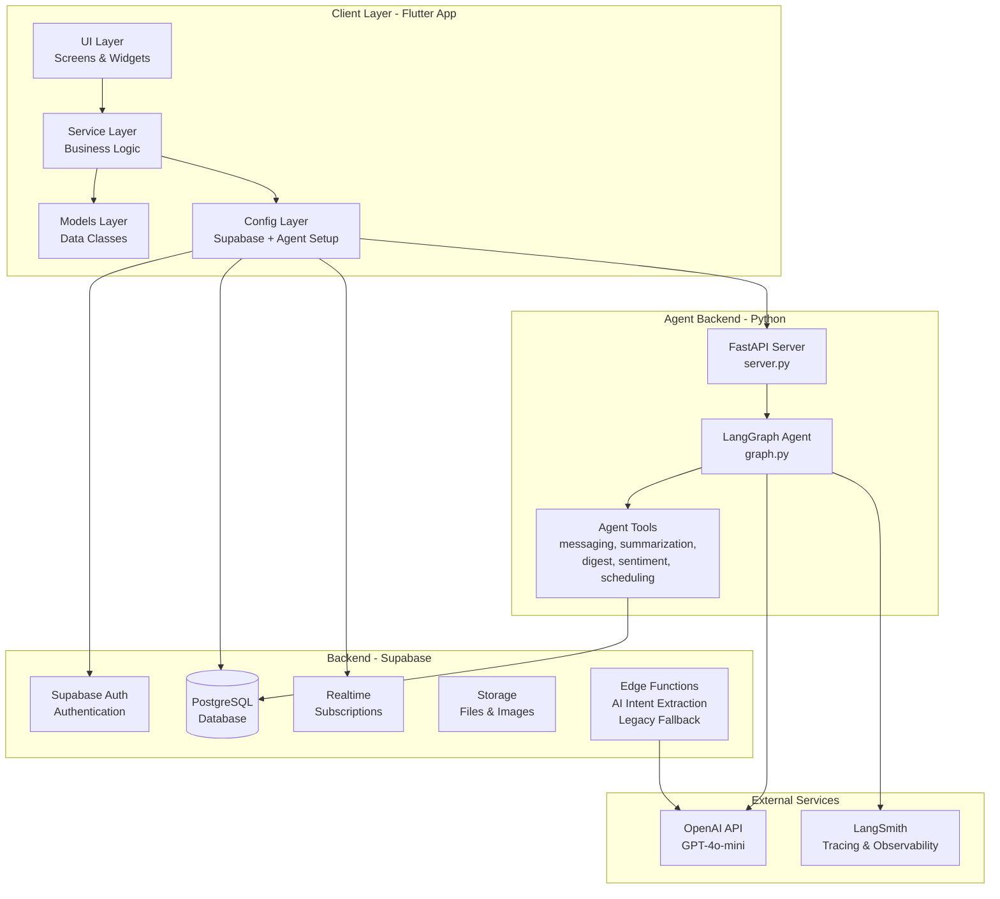
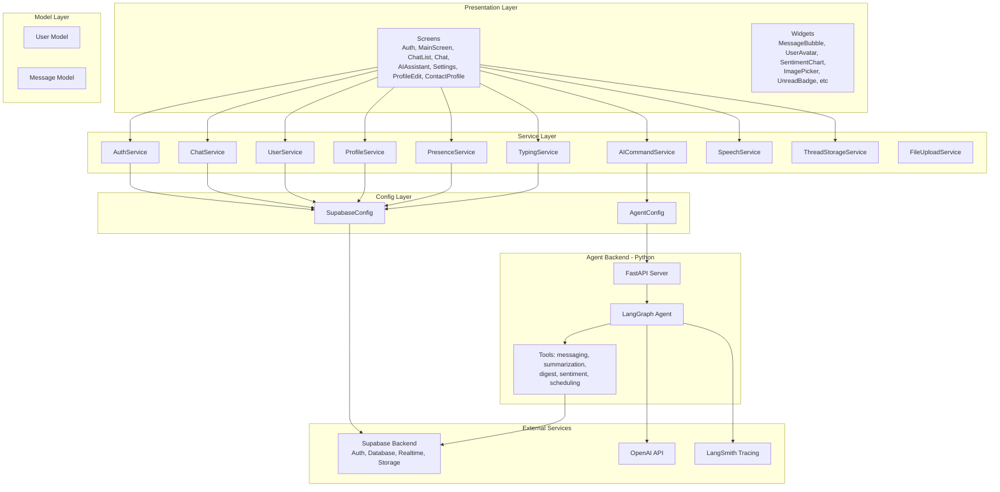
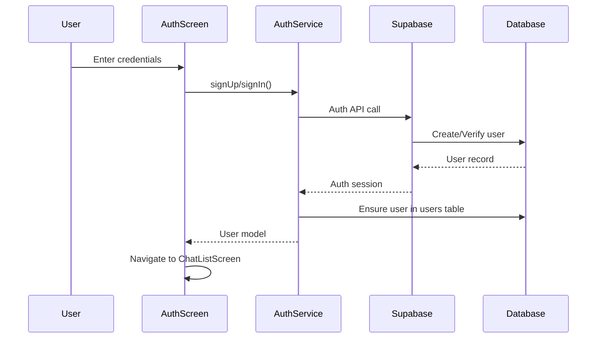
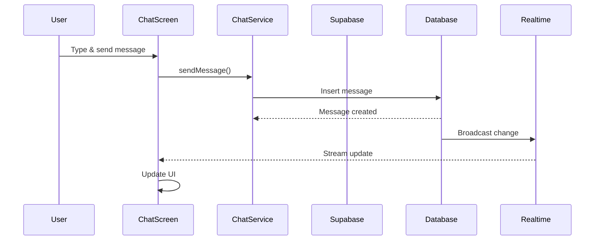
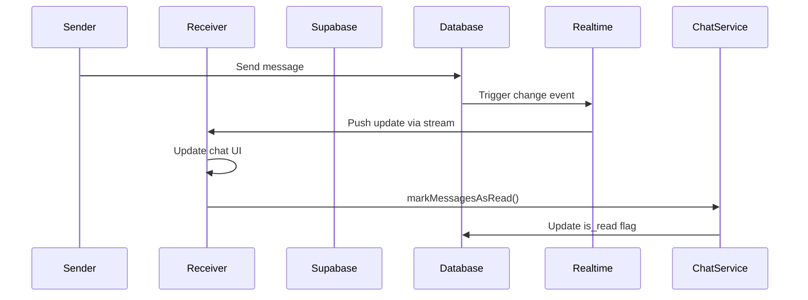
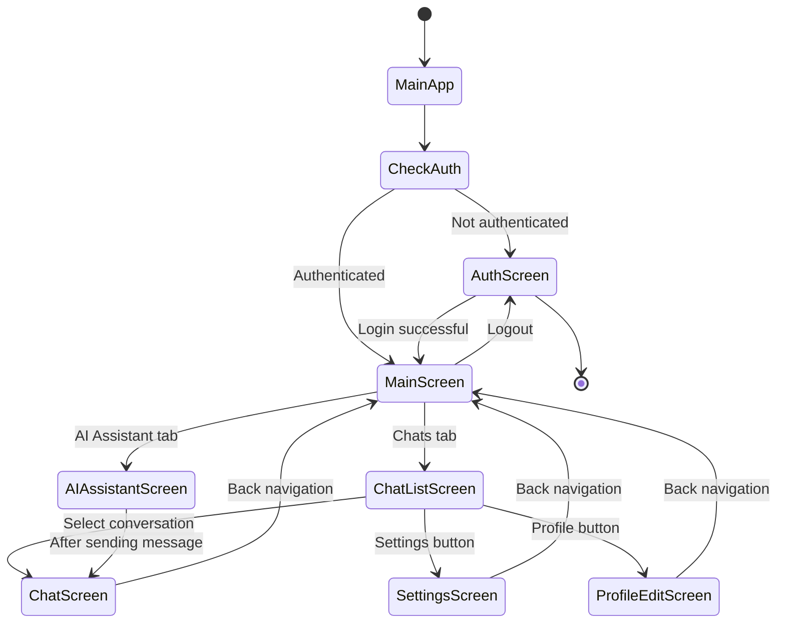
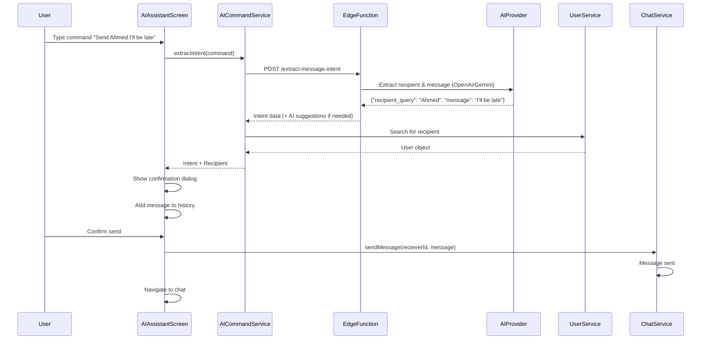
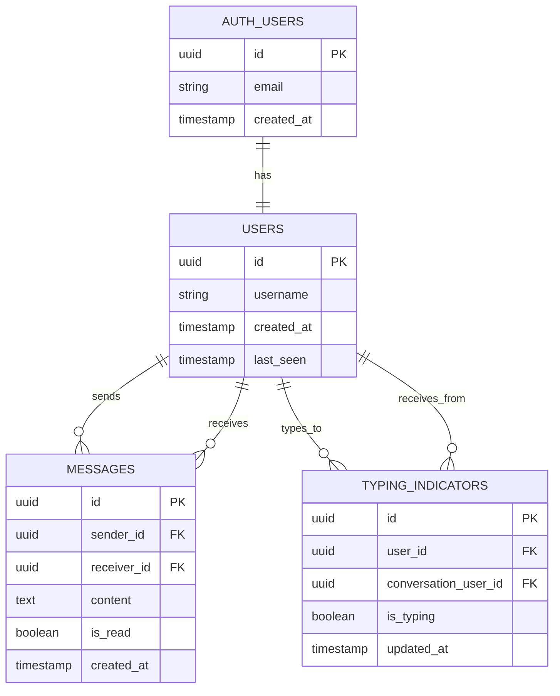
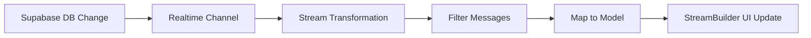
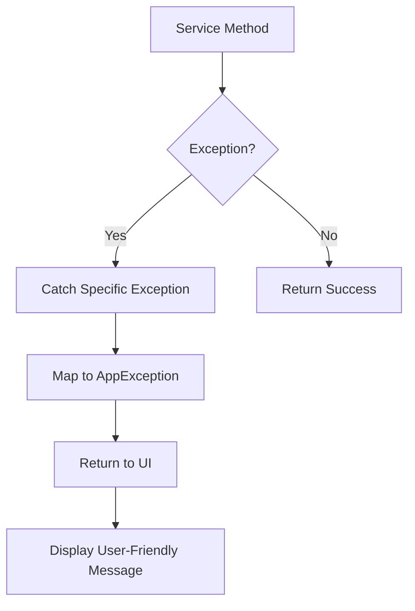

# Chat App Architecture Documentation

## Table of Contents
1. [Overview](#overview)
2. [System Architecture](#system-architecture)
3. [Project Structure](#project-structure)
4. [Data Flow](#data-flow)
5. [Component Details](#component-details)
6. [Technology Stack](#technology-stack)
7. [Database Schema](#database-schema)

---

## Overview

This is a real-time chat application built with Flutter and Supabase. The app enables users to authenticate, view a list of other users, engage in real-time conversations, and track unread messages.

### Key Features
- User authentication (Sign up / Sign in)
- Real-time messaging
- Chat list with conversation previews
- Unread message tracking
- Typing indicators
- Online/offline status (presence)
- User search functionality
- Profile editing (username, bio, profile picture)
- Image and file attachments
- Contact profiles
- **LangGraph AI agent backend** with natural language messaging
- **Conversation summarization** and **daily digest**
- **Sentiment analysis** with visual charts
- **Message scheduling** for future delivery
- **Voice commands** via speech-to-text
- **Thread persistence** for conversation continuity
- Dark/Light theme support
- Firebase Hosting deployment with build metadata

---

## System Architecture

### High-Level Architecture Diagram



### Layered Architecture



---

## Project Structure

```
lib/
├── main.dart                    # App entry point
├── config/
│   ├── supabase_config.dart    # Supabase initialization
│   ├── agent_config.dart       # LangGraph agent backend URL config
│   └── build_info.dart         # Auto-generated build metadata
├── exceptions/
│   └── app_exceptions.dart     # Custom exception classes
├── models/
│   ├── user.dart               # User data model
│   └── message.dart            # Message data model
├── screens/
│   ├── auth_screen.dart        # Authentication screen
│   ├── main_screen.dart        # Main container with bottom navigation
│   ├── chat_list_screen.dart   # List of conversations
│   ├── chat_screen.dart        # Individual chat screen
│   ├── ai_assistant_screen.dart # AI Assistant with LangGraph integration
│   ├── profile_edit_screen.dart # Profile editing screen
│   ├── contact_profile_screen.dart # Contact details view
│   └── settings_screen.dart    # App settings, deployment info, theme
├── services/
│   ├── auth_service.dart       # Authentication logic
│   ├── chat_service.dart       # Chat/messaging logic
│   ├── user_service.dart       # User management logic
│   ├── presence_service.dart   # Online/offline status management
│   ├── typing_service.dart     # Typing indicators management
│   ├── ai_command_service.dart # AI intent extraction (Edge Function fallback)
│   ├── speech_service.dart     # Speech-to-text voice input
│   ├── thread_storage_service.dart # LangGraph thread persistence
│   ├── file_upload_service.dart # Image upload/compression
│   ├── profile_service.dart    # Profile image and data management
│   ├── haptic_service.dart     # Haptic feedback
│   └── theme_service.dart      # Theme preference persistence
├── theme/
│   └── app_theme.dart          # App theming
├── utils/
│   ├── constants.dart          # App constants
│   ├── date_utils.dart         # Date formatting utilities (AppDateUtils)
│   └── icon_mapper.dart        # Icon mapping utilities
└── widgets/
    ├── loading_shimmer.dart    # Loading placeholder
    ├── message_bubble.dart     # Individual message widget
    ├── message_input.dart      # Message input field
    ├── user_avatar.dart        # User avatar widget
    ├── sentiment_chart_widget.dart # Sentiment analysis chart
    ├── image_picker_widget.dart # Image picker component
    └── unread_badge.dart       # Unread message count badge

smartchat-agent/                 # LangGraph AI agent backend
├── server.py                   # FastAPI REST API server
├── langgraph.json              # LangGraph Platform config
├── pyproject.toml              # Python dependencies
├── Dockerfile                  # Container config
├── render.yaml                 # Render deployment config
└── src/
    ├── agent/
    │   └── graph.py            # LangGraph agent definition
    └── tools/
        ├── messaging.py        # send_message, find_contacts
        ├── summarization.py    # Conversation summarization
        ├── digest.py           # Daily digest/briefing
        ├── sentiment.py        # Sentiment analysis
        ├── scheduling.py       # Message scheduling
        └── supabase_client.py  # Shared Supabase client
```

### Directory Responsibilities

| Directory | Purpose |
|-----------|---------|
| `config/` | Configuration and initialization code (Supabase, Agent, Build Info) |
| `exceptions/` | Custom exception classes for error handling |
| `models/` | Data classes representing domain entities |
| `screens/` | Full-screen UI components (pages/views) |
| `services/` | Business logic and data access layer |
| `theme/` | App-wide theming and styling |
| `utils/` | Helper functions, constants, and utilities |
| `widgets/` | Reusable UI components |
| `smartchat-agent/` | LangGraph AI agent backend (Python/FastAPI) |

---

## Data Flow

### Authentication Flow



### Message Sending Flow



### Real-time Message Reception Flow



### Screen Navigation Flow



### AI Command Flow



---

## Component Details

### Models

#### User Model
```dart
User {
  String id          // UUID from Supabase auth
  String username    // Display name (3-50 chars)
  String? email      // Optional email
  String? avatarUrl  // Profile picture URL
  String? bio        // User bio (max 500 chars)
  DateTime? createdAt
  DateTime? lastSeen
  DateTime? updatedAt
}
```

**Responsibilities:**
- Represents a user entity
- Handles JSON serialization/deserialization
- Provides copyWith for immutability

#### Message Model
```dart
Message {
  String? id          // Message UUID
  String senderId     // Sender's user ID
  String receiverId   // Receiver's user ID
  String content      // Message text
  bool isRead         // Read status
  DateTime createdAt  // Timestamp (parsed via AppDateUtils)
}
```

**Responsibilities:**
- Represents a chat message
- Handles message direction logic
- Provides helper methods (isSentBy, getOtherUserId)
- Uses AppDateUtils for consistent date parsing
- Logs warnings for missing or unparseable timestamps

---

### Services

#### AuthService
**Purpose:** Handles all authentication operations

**Key Methods:**
- `signUp()` - Register new user
- `signIn()` - Authenticate existing user
- `signOut()` - End user session
- `getCurrentUserProfile()` - Fetch current user data

**Dependencies:**
- Supabase Client (auth & database)

#### ChatService
**Purpose:** Manages messaging and conversation logic

**Key Methods:**
- `sendMessage()` - Send a new message
- `getConversationStream()` - Real-time message stream for a conversation
- `markMessagesAsRead()` - Update read status
- `processConversations()` - Aggregate conversation data

**Dependencies:**
- Supabase Client (database & realtime)

#### UserService
**Purpose:** Manages user data operations

**Key Methods:**
- `getUsersStream()` - Real-time stream of all users
- `getOtherUsersStream()` - Users excluding current user
- `searchUsers()` - Search users by username
- `getUserById()` - Fetch specific user
- `updateProfile()` - Update user profile (username, bio, avatar)
- `checkUsernameAvailability()` - Check if username is available

**Dependencies:**
- Supabase Client (database)

#### ProfileService
**Purpose:** Handles profile-related operations including image uploads

**Key Methods:**
- `uploadProfileImage()` - Upload profile picture to Supabase Storage
- `deleteProfileImage()` - Delete profile picture from storage
- `compressImage()` - Compress and optimize images (max 2000x2000px, 5MB)
- `validateUsername()` - Validate username format (3-50 chars, alphanumeric + underscore/hyphen)
- `validateBio()` - Validate bio length (max 500 chars)

**Dependencies:**
- Supabase Client (storage & database)
- Image processing library
- Platform-specific file handling

**Features:**
- Cross-platform image upload (web uses uploadBinary, mobile uses File)
- Automatic image compression and optimization
- Image validation (size, type, dimensions)
- Error handling with rollback mechanisms

#### PresenceService
**Purpose:** Manages user online/offline status

**Key Methods:**
- `updateLastSeen()` - Updates the current user's last_seen timestamp
- `startHeartbeat()` - Starts periodic heartbeat to update last_seen
- `stopHeartbeat()` - Stops the periodic heartbeat
- `dispose()` - Cleans up resources

**Dependencies:**
- Supabase Client (database & RPC functions)

**Usage:**
- Automatically updates user's last_seen when app is active
- Called on app foreground/background events
- Uses periodic timer (default: 30 seconds)

#### TypingService
**Purpose:** Manages real-time typing indicators

**Key Methods:**
- `setTyping()` - Sets typing status for a conversation
- `startTyping()` - Starts typing indicator (auto-stops after timeout)
- `stopTyping()` - Stops typing indicator
- `getTypingStream()` - Returns stream of typing status for a conversation
- `dispose()` - Cleans up resources

**Dependencies:**
- Supabase Client (database & realtime)

**Features:**
- Automatic timeout (3 seconds) if stopTyping is not called
- Real-time stream updates via Supabase subscriptions
- Filters typing status by conversation participants
- Validates typing status freshness (within 5 seconds)

#### AICommandService
**Purpose:** Handles AI-powered intent extraction and recipient resolution

**Key Methods:**
- `extractIntent(String command)` - Calls Supabase Edge Function to extract recipient and message from natural language
- `resolveRecipient(String query, List<User> users)` - Finds matching user from recipient query

**Dependencies:**
- Supabase Client (Edge Functions)

**Features:**
- Natural language command parsing via multi-provider AI (OpenAI and Gemini)
- Automatic provider fallback for reliability
- Automatic recipient matching (exact, partial, fuzzy)
- Error handling for extraction failures with AI-generated suggestions
- Returns structured intent data (recipient_query, message)
- Integrated with Supabase authentication state management

#### ThemeService
**Purpose:** Manages theme preference persistence

**Key Methods:**
- `loadThemeMode()` - Loads saved theme mode from SharedPreferences
- `saveThemeMode()` - Saves theme mode preference to SharedPreferences

**Dependencies:**
- SharedPreferences (local storage)

**Features:**
- Persists theme preference (System, Light, Dark) across app restarts
- Defaults to System theme if no preference is saved
- Static methods for easy access

#### SpeechService
**Purpose:** Speech-to-text voice command input

**Key Methods:**
- `initialize()` - Initialize speech recognition engine (safe to call multiple times)
- `startListening(onResult)` - Start listening, calls back with recognized text and final flag
- `stopListening()` - Stop and keep recognized text
- `cancel()` - Cancel and discard recognized text

**Dependencies:**
- `speech_to_text` package

**Features:**
- Singleton pattern (SpeechService.instance)
- Partial results during speech recognition
- Auto-initialization on first listen
- Platform-aware availability checking
- Error handling and status callbacks

#### ThreadStorageService
**Purpose:** Persists LangGraph agent thread IDs and message history locally per user

**Key Methods:**
- `loadThreadId(userId)` / `saveThreadId(userId, threadId)` / `clearThreadId(userId)` - Thread ID management
- `loadMessages(userId)` / `saveMessages(userId, messages)` / `clearMessages(userId)` - Message history persistence
- `clearAllThreads()` - Remove all stored threads and messages (used on logout)

**Dependencies:**
- SharedPreferences (local storage)
- dart:convert (JSON serialization)

**Features:**
- Per-user storage with key prefixes
- DateTime serialization to/from ISO strings
- Integrated with AuthService for cleanup on logout
- Enables conversation continuity across screen re-entries and app restarts

#### FileUploadService
**Purpose:** Handles image compression, validation, and upload to Supabase Storage

**Key Methods:**
- `uploadImage()` - Upload image to Supabase Storage bucket
- `compressImage()` - Compress and resize images (max 2000x2000px)
- `validateImage()` - Validate file size, type, and dimensions

**Dependencies:**
- Supabase Client (storage)
- Image processing library
- Platform-specific file handling

**Features:**
- Cross-platform support (web uses uploadBinary, mobile uses File)
- Automatic compression and optimization
- Error handling with rollback

---

### Screens

#### AuthScreen
**Purpose:** User authentication interface

**Features:**
- Toggle between Sign In / Sign Up
- Form validation
- Error handling and display
- Smooth animations

**State Management:**
- Local state with StatefulWidget
- Form validation
- Loading states

#### MainScreen
**Purpose:** Main container screen with bottom navigation

**Features:**
- Bottom navigation bar with two tabs: Chats and AI Assistant
- Tab switching between ChatListScreen and AIAssistantScreen
- Maintains navigation state

**State Management:**
- Local state with StatefulWidget
- Index-based tab navigation

#### ChatListScreen
**Purpose:** Display list of conversations

**Features:**
- Real-time user list
- Conversation previews (last message)
- Unread message badges
- User search
- Settings navigation
- Logout functionality

**State Management:**
- StreamBuilder for real-time updates
- Combined streams (users + messages)
- Search filtering

#### AIAssistantScreen
**Purpose:** AI-powered conversational interface backed by LangGraph agent

**Features:**
- Natural language command input with voice support
- LangGraph agent integration via FastAPI backend (primary path)
- Edge Function fallback for legacy intent extraction
- Two-step confirmation flow (preview then execute)
- Multi-recipient message support
- Conversation summarization display
- Sentiment analysis with visual charts (`SentimentChartWidget`)
- Daily digest display
- Message scheduling commands
- Thread persistence across sessions (via `ThreadStorageService`)
- Message history tracking (user and AI messages)
- Automatic scrolling to latest message
- Offline detection with retry logic
- Example command hints and suggestions
- Voice input toggle with speech-to-text

**State Management:**
- Local state with StatefulWidget
- Loading states during AI processing
- Error states for failed requests
- Message history state with local persistence
- Thread ID management for conversation continuity
- Authentication state integration
- Voice input state (listening/not listening)

#### ChatScreen
**Purpose:** Individual conversation interface

**Features:**
- Real-time message display
- Message input with send button
- Read status tracking

#### ProfileEditScreen
**Purpose:** User profile editing interface

**Features:**
- Edit username with real-time validation
- Edit bio (optional, multiline, 500 char limit)
- Upload/change profile picture (camera or gallery)
- Remove profile picture
- Username availability checking
- Image compression and preview
- Error handling with rollback
- Enhanced UI with improved styling and layout
- Dynamic keyboard handling with LayoutBuilder
- Better form organization with card-based layout
- Improved error message display with shadow effects

**State Management:**
- Local state with StatefulWidget
- Form validation
- Loading states
- Error states
- Keyboard-aware layout management

#### SettingsScreen
**Purpose:** App settings, preferences, and information interface

**Features:**
- Theme selection (System, Light, Dark) with radio buttons
- Real-time theme updates with persistence
- Deployment information (build timestamp, deploy timestamp, git commit, git branch, build environment)
- App version and build number display
- Rate app functionality
- External links (Privacy Policy, Terms of Service)
- URL launcher integration
- Clipboard copy for deployment details

**State Management:**
- Local state with StatefulWidget
- Syncs with MyApp theme state
- Package info loaded asynchronously
- Build info from auto-generated `BuildInfo` class

---

### Widgets

#### MessageBubble
**Purpose:** Display individual message

**Features:**
- Sent vs received styling
- Read/unread indicators
- Timestamp display
- Image attachment display with preview and loading states
- Smooth animations

#### UserAvatar
**Purpose:** Display user profile picture/initial

**Features:**
- Fallback to initials if no image
- Color coding by user
- Circular design
- Online status indicator

#### MessageInput
**Purpose:** Message composition widget

**Features:**
- Text input field
- Send button
- Image picker integration (gallery and camera)
- Attachment preview
- Input validation
- Auto-focus

#### LoadingShimmer
**Purpose:** Loading placeholder

**Features:**
- Shimmer animation effect
- List item placeholders
- Used during data loading

#### SentimentChartWidget
**Purpose:** Visualize sentiment analysis results

**Features:**
- Line chart rendering via `fl_chart` package
- Displays sentiment scores over time
- Color-coded sentiment levels
- Integrated into AI Assistant message bubbles

#### ImagePickerWidget
**Purpose:** Reusable image selection component

**Features:**
- Gallery and camera source options
- Cross-platform file handling
- Image preview before upload

#### UnreadBadge
**Purpose:** Display unread message count

**Features:**
- Circular badge with count
- Animated appearance
- Themed styling

---

### Utilities

#### AppDateUtils
**Purpose:** Centralized date and time operations

**Key Methods:**
- `parse(dynamic value)` - Parses DateTime from various formats (DateTime, String, or null)
- `parseOrDefault(dynamic value, DateTime? fallback)` - Parses with fallback
- `formatRelative(DateTime? dateTime)` - Formats as relative time (e.g., "2 minutes ago")
- `formatMessageTime(DateTime dateTime)` - Formats for message bubbles
- `formatFull(DateTime dateTime)` - Full timestamp with date and time
- `formatTime(DateTime dateTime)` - Time portion only
- `formatDate(DateTime dateTime)` - Date portion only
- `isToday(DateTime dateTime)` - Checks if date is today
- `isYesterday(DateTime dateTime)` - Checks if date is yesterday
- `isWithinLastWeek(DateTime dateTime)` - Checks if within last week

**Features:**
- Handles Supabase timestamp formats (ISO 8601, UTC)
- Proper UTC timezone handling for Supabase timestamps
- Consistent date parsing across the application
- Warning logs for debugging date-related issues
- Used by Message model for reliable date parsing

**Dependencies:**
- `intl` package for date formatting
- `timeago` package for relative time formatting

---

## Technology Stack

### Frontend
- **Framework:** Flutter (Dart SDK ^3.10.3)
- **State Management:** StatefulWidget + StreamBuilder
- **UI Libraries:**
  - `google_fonts` - Custom typography
  - `flutter_animate` - Animations
  - `shimmer` - Loading effects
  - `lucide_icons` - Icon set
  - `fl_chart` - Sentiment analysis charts

### Agent Backend (Python)
- **Framework:** FastAPI + Uvicorn
- **AI Orchestration:** LangGraph + LangChain
- **LLM:** OpenAI GPT-4o-mini
- **Database:** Supabase Python client (service role)
- **Deployment:** Docker on Render (free tier)
- **Observability:** LangSmith tracing
- **Python:** ≥3.11

### Backend (Supabase)
- **BaaS:** Supabase
  - **Auth:** Email/password authentication
  - **Database:** PostgreSQL (via Supabase)
  - **Realtime:** WebSocket-based real-time subscriptions
  - **Storage:** Profile pictures and message attachments
  - **Edge Functions:** Legacy AI intent extraction (fallback)

### External Services
- **OpenAI API:** GPT-4o-mini for agent reasoning and tool calling
- **LangSmith:** Execution tracing and observability

### Key Flutter Dependencies

```yaml
supabase_flutter: ^2.0.0      # Backend integration
intl: ^0.19.0                  # Internationalization
google_fonts: ^6.1.0           # Typography
shimmer: ^3.0.0                # Loading animations
flutter_animate: ^4.5.0        # UI animations
timeago: ^3.6.1                # Relative time formatting
shared_preferences: ^2.2.2     # Local storage for preferences
speech_to_text: ^7.0.0         # Voice command input
connectivity_plus: ^6.0.0      # Network connectivity detection
lucide_icons: ^0.257.0         # Icon set
package_info_plus: ^8.0.0      # App version info
url_launcher: ^6.2.0           # External URL handling
fl_chart: ^0.70.0              # Sentiment analysis charts
```

### Key Python Dependencies

```toml
langgraph >= 0.4.1             # Agent orchestration
langchain >= 0.3.0             # LLM framework
langchain-openai >= 0.3.0      # OpenAI integration
supabase >= 2.0.0              # Supabase Python client
python-dotenv >= 1.0.0         # Environment variables
pydantic >= 2.0.0              # Data validation
python-dateutil >= 2.8.0       # Date utilities
```

---

## Database Schema

### Tables

#### users
```sql
CREATE TABLE users (
  id UUID PRIMARY KEY REFERENCES auth.users(id),
  username TEXT NOT NULL,
  avatar_url TEXT,
  bio TEXT,
  created_at TIMESTAMP WITH TIME ZONE DEFAULT NOW(),
  last_seen TIMESTAMP WITH TIME ZONE DEFAULT NOW(),
  updated_at TIMESTAMP WITH TIME ZONE DEFAULT NOW(),
  CONSTRAINT check_username_length CHECK (LENGTH(username) >= 3 AND LENGTH(username) <= 50),
  CONSTRAINT check_bio_length CHECK (bio IS NULL OR LENGTH(bio) <= 500),
  CONSTRAINT users_username_key UNIQUE (username)
);
```

**Relationships:**
- `id` references `auth.users.id` (one-to-one with Supabase auth)

**Indexes:**
```sql
CREATE INDEX idx_users_last_seen ON users(last_seen);
```

#### messages
```sql
CREATE TABLE messages (
  id UUID PRIMARY KEY DEFAULT gen_random_uuid(),
  sender_id UUID REFERENCES users(id),
  receiver_id UUID REFERENCES users(id),
  content TEXT NOT NULL,
  is_read BOOLEAN DEFAULT FALSE,
  created_at TIMESTAMP WITH TIME ZONE DEFAULT NOW()
);
```

**Relationships:**
- `sender_id` → `users.id` (many-to-one)
- `receiver_id` → `users.id` (many-to-one)

**Indexes:**
```sql
CREATE INDEX idx_messages_receiver_unread 
ON messages(receiver_id, is_read) 
WHERE is_read = FALSE;
```

#### typing_indicators
```sql
CREATE TABLE typing_indicators (
  id UUID PRIMARY KEY DEFAULT gen_random_uuid(),
  user_id UUID REFERENCES users(id) ON DELETE CASCADE NOT NULL,
  conversation_user_id UUID REFERENCES users(id) ON DELETE CASCADE NOT NULL,
  is_typing BOOLEAN DEFAULT FALSE NOT NULL,
  updated_at TIMESTAMP WITH TIME ZONE DEFAULT NOW() NOT NULL,
  UNIQUE(user_id, conversation_user_id)
);
```

**Relationships:**
- `user_id` → `users.id` (many-to-one, the user who is typing)
- `conversation_user_id` → `users.id` (many-to-one, the user being typed to)

**Indexes:**
```sql
CREATE INDEX idx_typing_indicators_conversation 
ON typing_indicators(conversation_user_id, is_typing) 
WHERE is_typing = TRUE;
```

### Database Functions

#### mark_messages_as_read(sender_user_id UUID)
**Purpose:** Marks messages as read for a specific sender
- Security: SECURITY DEFINER (bypasses RLS)
- Returns: Number of messages updated
- Used by: ChatService

#### update_last_seen()
**Purpose:** Updates the current authenticated user's last_seen timestamp
- Security: SECURITY DEFINER (bypasses RLS)
- Used by: PresenceService

### Entity Relationship Diagram



---

## Real-time Architecture

### Stream Subscription Pattern

The app uses Supabase's real-time streams to update UI automatically:

1. **User Stream:**
   ```dart
   Stream<List<User>> getUsersStream()
   ```
   - Subscribes to `users` table changes
   - Updates when users are added/modified

2. **Message Stream:**
   ```dart
   Stream<List<Message>> getConversationStream(String otherUserId)
   ```
   - Subscribes to `messages` table changes
   - Filters by conversation participants
   - Orders by creation time

3. **Typing Indicator Stream:**
   ```dart
   Stream<bool> getTypingStream(String conversationUserId)
   ```
   - Subscribes to `typing_indicators` table changes
   - Filters by conversation participants
   - Validates typing status freshness

### Stream Processing



---

## Error Handling

### Exception Hierarchy

```
AppException (abstract)
├── AuthException
│   ├── invalidCredentials()
│   ├── userNotFound()
│   ├── notAuthenticated()
│   └── emailInUse()
├── NetworkException
├── DatabaseException
├── ChatException
│   ├── emptyMessage()
│   └── sendFailed()
└── AICommandException
    ├── extractionFailed()
    └── recipientNotFound()
```

### Error Flow



---

## Theme System

### Theme Structure

```dart
AppTheme {
  lightTheme: ThemeData
  darkTheme: ThemeData
}
```

**Features:**
- Light and dark mode support
- Custom color schemes
- Typography using Google Fonts
- Consistent spacing and styling

### Theme Mode

- **System default:** Follows device preference
- **Theme selection:** User can choose between System, Light, or Dark theme via Settings screen
- **Persistence:** Theme preference is saved using SharedPreferences and persists across app restarts
- **Access:** Settings screen accessible from ChatListScreen AppBar

---

## Security Considerations

### Authentication
- Uses Supabase Auth for secure authentication
- Passwords handled by Supabase (never stored locally)
- JWT tokens managed by Supabase client

### Data Security
- Row Level Security (RLS) should be configured on Supabase
- User can only access their own messages
- User can only update their own profile
- Storage policies restrict profile picture uploads to user's own folder
- User IDs verified on client and server

### Configuration
- Supabase credentials via `--dart-define` flags
- Fallback values for development only
- Production should use environment variables

---

## Performance Optimizations

1. **Stream Efficiency:**
   - Primary key indexing for efficient real-time subscriptions
   - Filtered streams to reduce data transfer

2. **UI Performance:**
   - Shimmer loading states prevent layout shifts
   - Efficient ListView.builder usage
   - Image caching for avatars

3. **Database:**
   - Indexed queries on `receiver_id` and `is_read`
   - Partial indexes for unread messages
   - Unique constraint on username for fast availability checks
   - Index on `avatar_url` for efficient queries

4. **Image Optimization:**
   - Automatic compression (max 2000x2000px, quality 85)
   - JPEG format for smaller file sizes
   - Progressive quality reduction if needed

---

## Future Enhancements

Potential improvements and features:

- [ ] Push notifications
- [x] Image/file sharing
- [ ] Message reactions
- [ ] Group chats
- [ ] Message search
- [ ] Message deletion
- [x] Profile editing (username, bio, profile picture)
- [x] Theme toggle UI
- [x] AI-powered command-based messaging (LangGraph agent)
- [x] Conversation summarization
- [x] Daily digest / briefing
- [x] Sentiment analysis with charts
- [x] Message scheduling
- [x] Voice commands (speech-to-text)
- [x] Thread persistence
- [x] Offline detection and retry logic
- [x] Multi-recipient messaging
- [x] Firebase Hosting deployment
- [x] Build metadata and deploy timestamps
- [ ] Read receipts (detailed)
- [ ] Message encryption
- [ ] Auto-responder via agent
- [ ] Smart message suggestions

---

## Development Notes

### Running the App

```bash
# Install dependencies
flutter pub get

# Run with environment variables
flutter run --dart-define=SUPABASE_URL=your_url \
             --dart-define=SUPABASE_ANON_KEY=your_key
```

### Database Setup

Run the SQL script `supabase_setup.sql` in your Supabase SQL editor to set up the required tables and indexes.

### AI Command Feature Setup

**Option 1: Using OpenAI (Default)**
1. Get an OpenAI API key from https://platform.openai.com/api-keys
2. Set the API key in Supabase Edge Functions secrets:
   ```bash
   supabase secrets set ChatApp=your_openai_key_here
   ```

**Option 2: Using Gemini**
1. Get a Gemini API key from https://aistudio.google.com/app/apikey
2. Set the API key in Supabase Edge Functions secrets:
   ```bash
   supabase secrets set GEMINI_API_KEY=your_gemini_key_here
   supabase secrets set AI_PROVIDER=gemini
   ```

**Option 3: Configure Both Providers (Recommended)**
1. Set up both providers for automatic fallback:
   ```bash
   supabase secrets set ChatApp=your_openai_key_here
   supabase secrets set GEMINI_API_KEY=your_gemini_key_here
   supabase secrets set AI_PROVIDER=openai
   supabase secrets set AI_FALLBACK_PROVIDER=gemini
   ```

**Deploy the Edge Function:**
```bash
supabase functions deploy extract-message-intent
```

See `DEPLOYMENT_GUIDE.md` and `supabase/functions/extract-message-intent/README.md` for detailed instructions.

### Project Configuration

- Minimum Flutter SDK: ^3.10.3
- Target platforms: Android, iOS, Web, Linux, macOS, Windows
- Uses Material Design

---

## Maintaining Documentation

### Automatic Updates

**Important:** Mermaid diagrams in this document are **static** and will **not automatically update** when you change code. Mermaid is a diagram syntax, not an auto-updating tool.

However, you can use code analysis tools to generate structural diagrams:

#### Option 1: Use LayerLens (for dependency diagrams)

```bash
# Install LayerLens globally
dart pub global activate layerlens

# Generate dependency diagrams
layerlens lib > docs/generated/dependencies.mmd
```

#### Option 2: Use CodeUML (for class diagrams)

```bash
# Install CodeUML
dart pub global activate code_uml

# Generate class diagrams in Mermaid format
code_uml lib --output mermaid > docs/generated/classes.mmd
```

#### Option 3: Use the provided script

```bash
# Run the architecture generation script
./scripts/generate_architecture.sh
```

### Manual Updates Required

The following diagrams require **manual updates** when architecture changes:

- Authentication flow sequences
- Message sending/receiving flows  
- Screen navigation flows
- Real-time architecture patterns
- Error handling flows
- Conceptual architecture diagrams

### When to Update

Update this document when:
- Adding new services, screens, or major features
- Changing data models or database schema
- Modifying architecture patterns (e.g., state management)
- Updating dependencies or tech stack
- Adding new architectural patterns

### Quick Update Checklist

- [ ] Update project structure section
- [ ] Update component details
- [ ] Update sequence diagrams if flows changed
- [ ] Update database schema if tables changed
- [ ] Update technology stack if dependencies changed
- [ ] Update data flow diagrams if patterns changed

---

## Glossary

| Term | Definition |
|------|------------|
| **Supabase** | Backend-as-a-Service providing Auth, Database, and Realtime |
| **Stream** | Real-time data flow using Dart Streams |
| **RLS** | Row Level Security (database access control) |
| **BaaS** | Backend-as-a-Service |
| **JWT** | JSON Web Token (authentication token) |

---

**Last Updated:** February 2026
**Version:** 2.0.0
