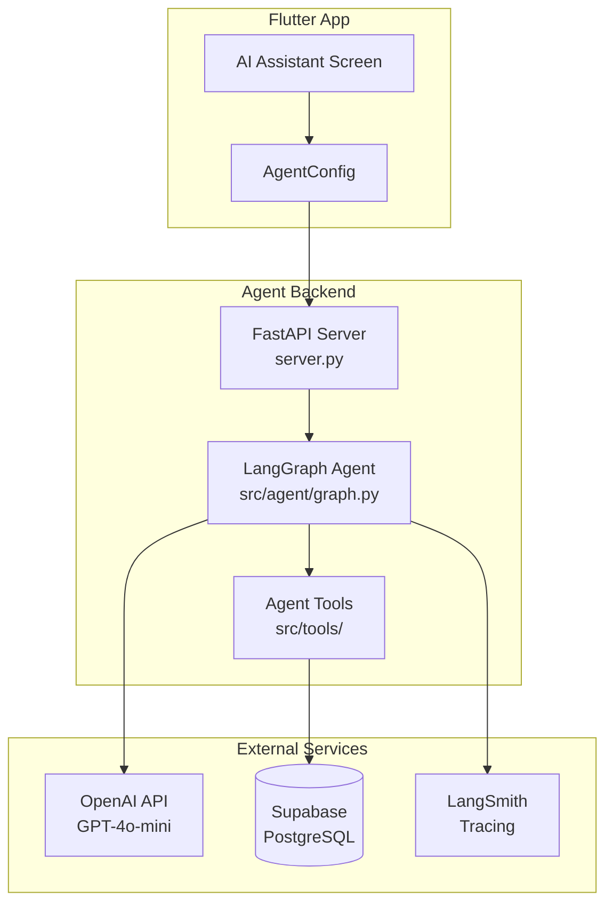

# SmartChat Agent

LangGraph-powered AI agent backend for the SmartChat Flutter app. Handles natural language commands for messaging, conversation intelligence, and task automation.

**Live deployment:** [smartchat-agent.onrender.com](https://smartchat-agent.onrender.com)

## Architecture



## Available Tools

| Tool | Description |
|------|-------------|
| `send_message` | Send a message to one or multiple recipients |
| `find_contacts` | Search for contacts by name |
| `get_recent_conversations` | Fetch recent conversation history |
| `summarize_conversation` | Summarize a conversation with a contact (supports time ranges) |
| `get_daily_digest` | Get a daily activity briefing/digest |
| `analyze_sentiment` | Analyze the mood/sentiment of a conversation |
| `schedule_message` | Schedule a message for future delivery |
| `list_scheduled_messages` | View all pending scheduled messages |
| `cancel_scheduled_message` | Cancel a scheduled message |

## Project Structure

```
smartchat-agent/
├── server.py              # FastAPI REST API server
├── langgraph.json         # LangGraph Platform config
├── pyproject.toml         # Python dependencies
├── Dockerfile             # Container config for deployment
├── render.yaml            # Render deployment config
├── .env.example           # Required environment variables
├── supabase_migrations/   # Database migrations for scheduling
└── src/
    ├── agent/
    │   └── graph.py       # LangGraph agent definition & system prompt
    └── tools/
        ├── messaging.py       # send_message, find_contacts, get_recent_conversations
        ├── summarization.py   # summarize_conversation
        ├── digest.py          # get_daily_digest
        ├── sentiment.py       # analyze_sentiment
        ├── scheduling.py      # schedule/list/cancel scheduled messages
        └── supabase_client.py # Shared Supabase client
```

## Setup

### Prerequisites

- Python ≥ 3.11
- OpenAI API key
- Supabase project with service role key
- LangSmith API key (for tracing)

### Environment Variables

Copy `.env.example` to `.env` and fill in your values:

```bash
cp .env.example .env
```

| Variable | Description |
|----------|-------------|
| `OPENAI_API_KEY` | OpenAI API key (required) |
| `SUPABASE_URL` | Supabase project URL (required) |
| `SUPABASE_SERVICE_KEY` | Supabase service role key (required) |
| `LANGSMITH_API_KEY` | LangSmith API key (required for tracing) |
| `LANGCHAIN_TRACING_V2` | Set to `true` to enable tracing |
| `LANGCHAIN_PROJECT` | LangSmith project name (default: `smartchat-agent`) |

### Local Development

**Using LangGraph CLI (recommended):**

```bash
cd smartchat-agent
pip install -e .
langgraph dev
```

This starts the LangGraph Studio dev server with hot reload.

**Using FastAPI directly:**

```bash
cd smartchat-agent
pip install -e ".[dev]" uvicorn fastapi
python server.py
```

Server runs at `http://localhost:8080`.

### API Endpoints

| Method | Endpoint | Description |
|--------|----------|-------------|
| `GET` | `/health` | Health check |
| `POST` | `/agent` | Run the agent with a message |

#### POST `/agent` — Request Body

```json
{
  "message": "Send Ahmed I'll be late",
  "user_id": "uuid-of-current-user",
  "thread_id": "optional-thread-uuid",
  "confirm_only": false,
  "execute": false
}
```

- **`confirm_only: true`** — Preview mode: agent extracts intent and returns a pending action without sending
- **`execute: true`** — Execute after user confirms the preview

#### Response

```json
{
  "response": "Message sent to Ahmed!",
  "thread_id": "uuid",
  "tool_results": [{"status": "sent", "recipient": "Ahmed"}],
  "pending_action": null
}
```

## Two-Step Confirmation Flow

The Flutter app uses a two-step flow for sending messages:

1. **Preview** (`confirm_only: true`) — Agent identifies recipients and message, returns a `pending_action` for the user to review
2. **Execute** (`execute: true`, same `thread_id`) — After user confirms, agent sends the message

This prevents accidental sends and gives users control.

## Deployment

### Render (Current)

The agent is deployed to Render using Docker. Configuration is in `render.yaml`.

```bash
# Render auto-deploys from the repository
# Set environment variables in Render dashboard
```

### Docker

```bash
docker build -t smartchat-agent .
docker run -p 8080:8080 --env-file .env smartchat-agent
```

## Database Requirements

The agent uses the Supabase service role key to interact with the database directly. Required tables:

- `users` — User profiles (read for contact lookup)
- `messages` — Message storage (read/write for messaging and summarization)
- `scheduled_messages` — Scheduled message queue (see `supabase_migrations/`)

## LangSmith Tracing

When `LANGCHAIN_TRACING_V2=true`, all agent invocations are traced in LangSmith, providing:

- Full execution traces for each tool call
- Latency breakdowns per node
- Token usage tracking
- Error debugging

View traces at [smith.langchain.com](https://smith.langchain.com).
